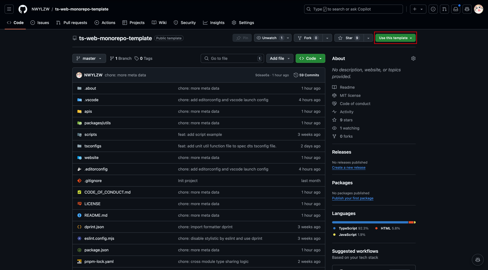

# TypeScript Web Monorepo Template

| zh-Hans | [en-US](.about/en-US/README.md) |

用于在 monorepo 架构下最现代最前沿的快速开发 web 应用的模版项目。

## 为什么用我

- 轻量：未引入框架，只有最基础的工具链，可以灵活决定项目技术栈
- 安全：类型系统的设计更加准确，带来的是完善的检查机制
- 丰富：整理了常见的场景的最佳实践，可以很方便的根据已有内容快速扩张迭代
- 现代：使用支持**最规范**也是**最前沿**的标准来决定项目的组织方式
- 易用：提供了初始化的脚本，可以快速的为项目配置你的元信息，无需手动一个个处理
- 高效：一般的 monorepo 的跨包跳转只能跳转到编译后的内容，本项目可以直接跳转到源码，极大地提高了开发效率

## 怎么用我

### 初始化

1. 点击右上角的 `Use this template` 按钮

2. 根据提示填写你的项目信息
3. 克隆你的项目到本地
4. 运行 `./scripts/rename-project-and-reset-autor.sh` 脚本，根据提示填写你的项目信息
5. 运行 `pnpm install` 安装依赖
6. 运行 `pnpm --filter website start` 启动开发服务器

### 同步

TODO...

## 了解本项目

- [设计](.about/DESIGN.md)
- [如何参与贡献](.about/CONTRIBUTING.md)
- [行为守则](./CODE_OF_CONDUCT.md)
